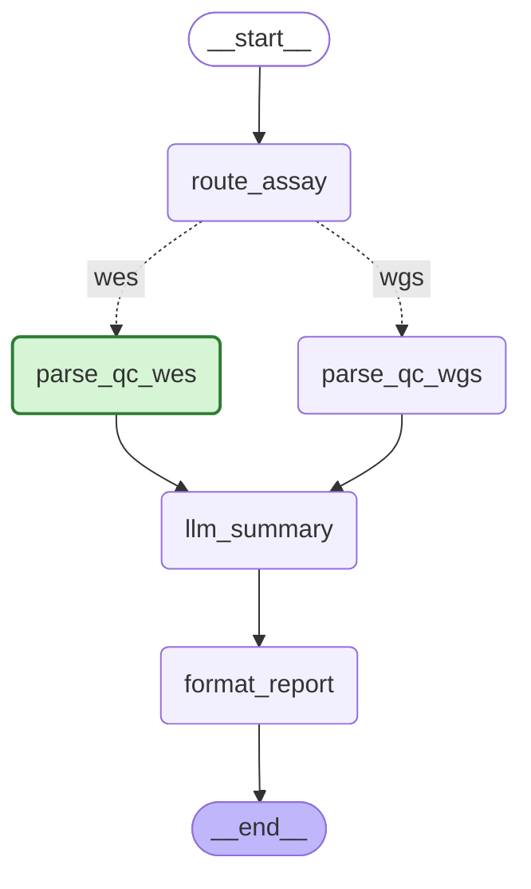

# QC Report — SAMPLE_001_clean

**Assay:** Whole Exome Sequencing (WES)  
**Overall Status:** ✅ PASS

## Metrics Summary

|  | Metric | Value | Status |
|--|--------|-------|--------|
| ℹ️ | Mapped | 87500000 | INFO |
| ✅ | MappedFraction | 0.971 | PASS |
| ℹ️ | DuplicateMarked | 8750000 | INFO |
| ✅ | DuplicateFraction | 0.1 | PASS |
| ✅ | MedianMAPQ | 58 | PASS |
| ✅ | FractionInBed | 0.821 | PASS |
| ✅ | MedianCoverage | 87.3 | PASS |
| ℹ️ | SDCoverage | 32.1 | INFO |
| ✅ | EnrichmentOverBed | 18.4 | PASS |
| ℹ️ | MedianInsertSize | 185 | INFO |
| ℹ️ | SDInsertSize | 52.3 | INFO |
| ✅ | GCContent | 0.412 | PASS |

Legend: ✅ PASS ⚠️ WARN ❌ FAIL ℹ️ INFO (not thresholded) ❓ MISSING

## Biological Interpretation

Good news! Your sample, SAMPLE_001_clean, passed all quality control checks with excellent results. We see a high proportion of your sequencing data mapped correctly to the human genome, and the sequencing effort was highly focused on the exome regions you're interested in. Crucially, the median coverage across your target regions is 87x, which is well above our 30x target, ensuring robust and reliable detection of genetic variants. You can confidently proceed with your downstream analysis, such as variant calling, without any concerns about data quality.

## Workflow

